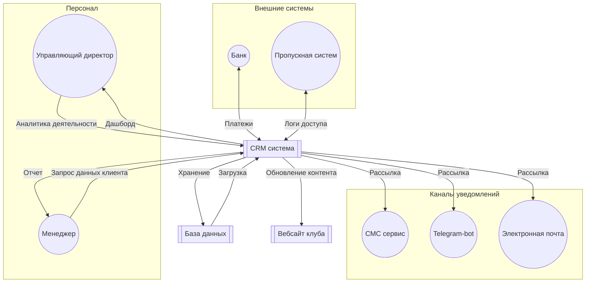
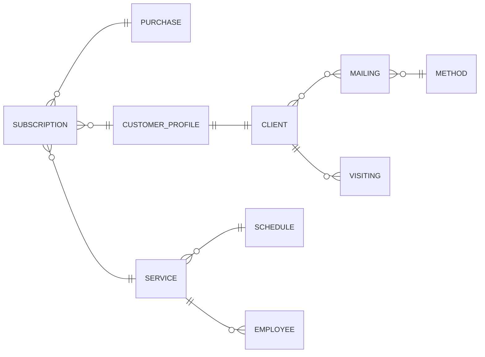
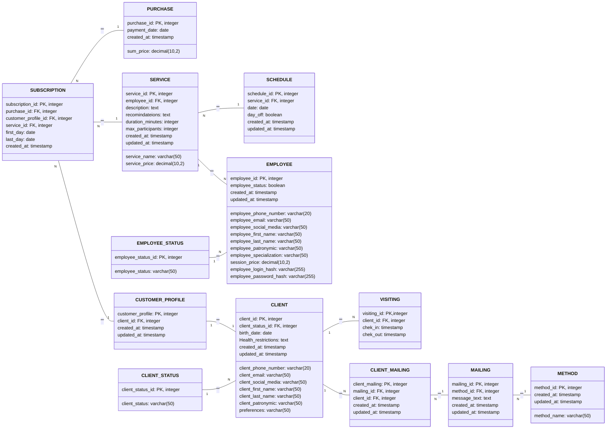
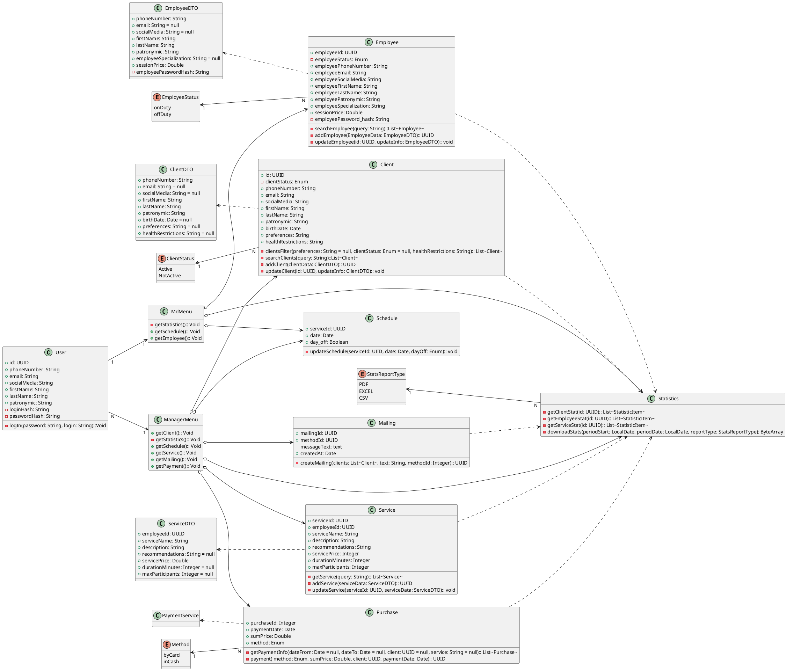
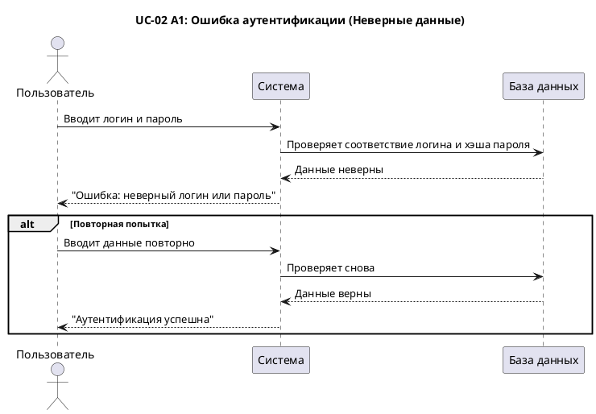
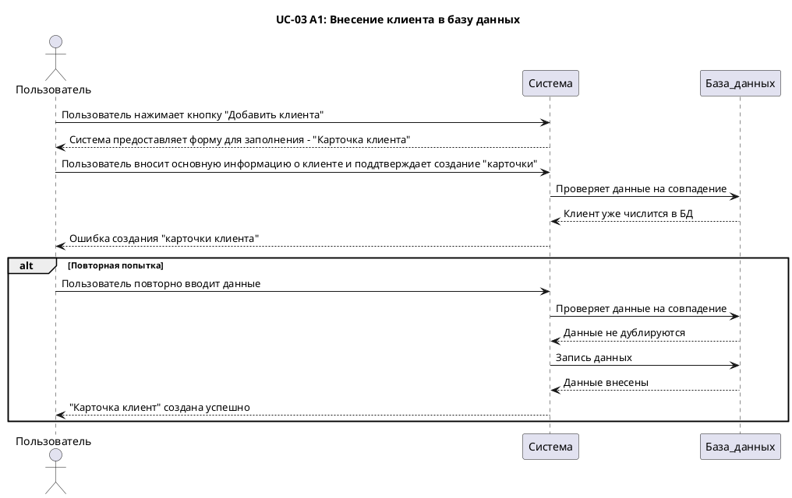
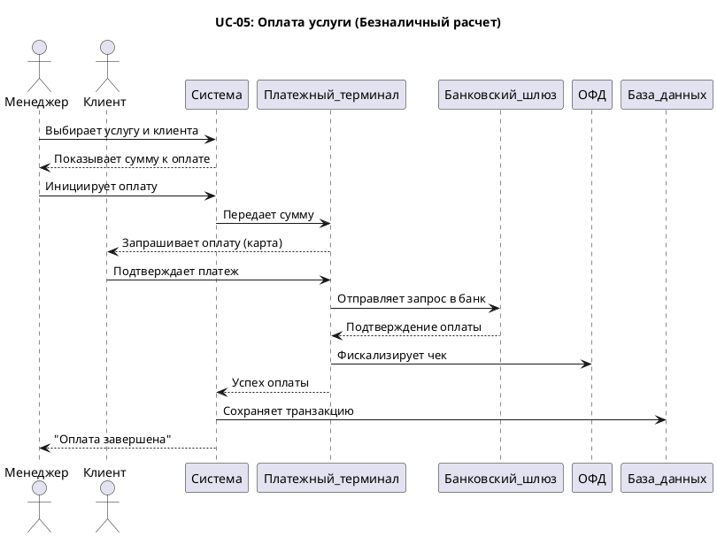
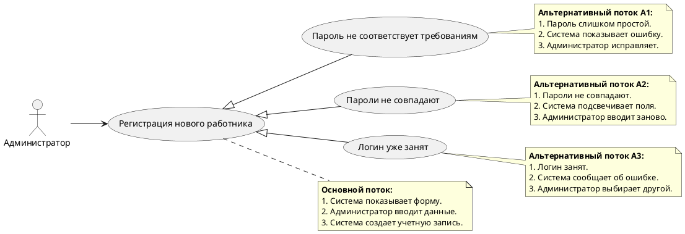

<style>
/* Разрыв страницы перед каждым H1 */
h2 {
    page-break-before: always;
}

/* Заголовок и контент на одной странице */
h3, h4 {
    page-break-after: avoid;
}
</style>

## 1. Введение
### 1.1. Назначение документа
Документ описывает требования к CRM системе для контрля и управления клиентской базой и финансами фитнес-клуба.
### 1.2. Область применения
Система будет использоваться 
- Менеджерами отдела продаж для ведения и актуализации клиентской базы, ведения истории продаж абониментов и дополнительных услуг, рассылки уведомлений клиентам.
- ГД для формирования отчетности по загруженности клуба, продажам.
### 1.3. Цель проекта
Создать единую систему для взаимотношения с клиентами и ведения отчетности
### 1.4. Глоссарий 
### Глоссарий

#### 1. Основные термины
| Термин             | Определение                                                                                   |
| ------------------ | --------------------------------------------------------------------------------------------- |
| CRM система        | Программное обеспечение для управления взаимодействием с клиентами, учета продаж и аналитики  |
| Клиент             | Физическое лицо, пользующееся услугами фитнес-клуба (действительный или потенциальный клиент) |
| Абонимент          | Пакет услуг фитнес-клуба, приобретаемый клиентом на определенный срок                         |
| Транзакция         | Операция оплаты услуги (наличными или банковской картой)                                      |
| Пропускная система | Система контроля доступа в клуб (браслеты, карты, биометрия)                                  |

#### 2. Роли пользователей
| Термин                    | Определение                                                                        |
| ------------------------- | ---------------------------------------------------------------------------------- |
| Менеджер                  | Сотрудник, отвечающий за продажи, работу с клиентами и ведение базы данных         |
| Управляющий директор (ГД) | Руководитель клуба, получающий аналитику по продажам, посещаемости и загруженности |
| Администратор             | Пользователь с правами регистрации новых сотрудников в системе                     |

#### 3. Технические термины
| Термин             | Определение                                                                            |
| ------------------ | -------------------------------------------------------------------------------------- |
| API                | Интерфейс для взаимодействия CRM с внешними системами (банк, пропускная система и др.) |
| Webhook            | Механизм автоматической отправки данных между системами в реальном времени             |
| SMTP               | Протокол для отправки email-уведомлений                                                |
| ОФД (Онлайн-касса) | Система передачи фискальных данных в налоговую службу                                  |
| Хеширование        | Защитное преобразование паролей в необратимый формат (например, MD5)                   |

#### 4. Уведомления и коммуникация
| Термин       | Определение                                                      |
| ------------ | ---------------------------------------------------------------- |
| SMS-сервис   | Внешний сервис для массовой рассылки SMS (например, SMS Aero)    |
| Telegram-bot | Автоматизированный бот для отправки уведомлений через Telegram   |
| Рассылка     | Массовая отправка сообщений клиентам (акции, напоминания и т.д.) |

#### 5. База данных и аналитика
| Термин                            | Определение                                                                 |
| --------------------------------- | --------------------------------------------------------------------------- |
| Карточка клиента                  | Профиль клиента в CRM с персональными данными, историей посещений и покупок |
| Дашборд                           | Визуализированная сводка ключевых метрик для руководства                    |
| ERD (Entity-Relationship Diagram) | Диаграмма сущностей и связей в базе данных                                  |

#### 6. Статусы
| Термин             | Определение                                                |
| ------------------ | ---------------------------------------------------------- |
| Активный клиент    | Клиент с действующим абониментом                           |
| Неактивный клиент  | Клиент без действующего абонимента (но сохраненный в базе) |
| Сотрудник на смене | Тренер или менеджер, находящийся в рабочее время в клубе   |

#### 7. Безопасность
| Термин                      | Определение                                         |
| --------------------------- | --------------------------------------------------- |
| ART (Average Response Time) | Среднее время отклика системы (требование: ≤ 1.5 с) |
| RPS (Requests Per Second)   | Количество запросов в секунду (требование: 50 RPS)  |

## 2. Общее описание системы
### 2.1. Контекст системы
Система взаимодействует с:
- менеджером по средству приложения
- ГД по средству приложения
- с мессенджера для рассылки уведомлений (Telegram-bot)
- c SMS сервисами для рассылки уведомлений (SMS-Aero)
- с почтой для рассылки уведомлений (SMTP + App Password)
- с банком через WEBhook (Сбербанк Business Online API)
- с вебсайтом через API CRM системы для предоставления информации о предоставляемых услугах
- с пропускной системой (браслеты, карты) через Ready4Sky + http/API 

### 2.2. Диаграмма контекста


### 2.2. Бизнес требования
- обеспечить 10% от притока новых посетителей путем привлечения неактивных клиентов (email/SMS рассылки и персональные предложеня) в течение 3 месяцев после внедрения
- сократить штат менеджеров отдела продаж за 6 месяцев без снижения выручки
### 2.3. Ограничения
- оплата услуг исключительно оффлайн
- веб-сайт клуба уже в работе

## 3. Функциональные требования
UC-01: Регистрация новых работников  
Актор: ГД
Основной поток:
1. Система предоставляет форму для создания учетной записи работника (ФИО, логин, пароль, подтверждение пароля)
2. Администратор регистрирует нового пользователя
3. Система создает учетную запись, хэширует пароль
  
Альтернативный поток:  
- А1: Пароль не соответсвует требованиям  
  1. На шаге 2 система проверяет данные
  2. Система сообщает об ошибке и предоставляет требования для пароля во всплывающем окне
  3. Администратор повторно вводит пароль согласно требованиям
  4. Система создает учетную запись, хэширует пароль 
- А2: Пароли не совпадают  
  1. На шаге 2 система проверяет совпадение паролей
  2. Система сообщает об ошибке, подсвечивает поля с паролями
  3. Администратор повторно вводит пароль согласно требованиям
  4. Система создает учетную запись, хэширует пароль 
- А3: Логин уже занят
  1. На шаге 2 система проверяет данные, сравнивает введеный логин с уже существующими
  2. Система сообщает об ошибке, подсвечивает поле для логина
  3. Администратор повторно вводит иной логин
  4. Система создает учетную запись, хэширует пароль 

UC-02: Аутентификация пользователя  
Актор: Менеджер, ГД
Основной поток:  
1. Система предоставляет форму для аутентификации (логин, пароль)
2. Пользователь вводин данные
3. Система авторизует пользователя

Алтернативный поток:  
- А1: Неверный логин/пароль
  1. На шаге 2 система проверяет введенные данные
  2. Система сообщает об ошибке аутентификации
  3. Пользователь вводин данные повторно
  4. Система авторизует пользователя

UC-03: Внесение информации о новом клиент в базу данных  
Актор: Менеджер  
Основной поток: 
1. Система предоставляет раздел "Клиенты" главного меню (боковая панель)
2. Пользователь переходит в раздел "Клиенты"
3. Система предоставляет список клиентов с личными данными
4. Пользователь нажимает кнопку "Добавить клиента"
5. Система предоставляет форму для заполнения - "Карточка клиента"
6. Пользователь вносит основную информацию о клиенте (ФИО, телефон, email, соцсети) и поддтверждает создание "карточки"
7. Система сообщает об успешном внесении информации о клиенте в базу данных

Альтернативный поток:
 - А1: Клиент уже внесен в базу данных
   1. На шаге 5 система проверяет внесенные данные (Совпадение ФИО, контактных данных)
   2. Система сообщает о дублирующихся данных и просит подтвердить внесение информации 
   3. Пользователь отменяет заполнение формы
   4. Система перенесит пользователя на главное меню
 - А2: Совпадают ФИО разных клиентов
   1. На шаге 5 система проверяет внесенные данные (Совпадение ФИО, контактных данных)
   2. Система сообщает о дублирующихся данных и просит подтвердить внесение информации 
   3. Пользователь подтверждает внесение информации
   4. Система сообщает об успешном внесении информации о клиенте в базу данных

UC-04: Поиск карточки клиента  
Актор: Менеджер  
Основной поток:
1. Пользователь переходить в раздел "Клиенты" боковой панели главного меню
2. Система предоставляет поисковую строку 
3. Пользователь вводит ФИО, id или контактную информацию
4. Система предоставляет все существующие "карточки" с совпадающими данными
5. Пользоваетель переходит на необходиму "карточку"

Альтернативный поток:
 - А1: Совпадений не найдено
   1. На шаге 3 система производит поиск по указанным данным
   2. Система сообщает об ошибке поиска

UC-05: Продажа услуги  
Актор: Менеджер, клиент  
Основной поток:
1. Система предоставляет вкладку "Оплата" на боковой панели главного меню
2. Пользователь нажимает на кнопку "Новая транзакция" в разделе "Оплата"
3. Система предоставляет форму для заполнения
4. Пользователь выбирает клиента из базы данных с помощью поисковой строки 
5. Пользователь выбирает услугу и способ оплаты через терминал
6. Система связывается с терминалом
7. Клиент оплаичивает услугу через терминал
8. Терминал передает данные банку через банковский шлюз
9. Банк возвращает информацию и подтверждает оплату услуги
10. Система сохраняет чек оплаты в разделе "Продажи"
11. Система дублирует информацию о приобретенной услуге в "карточке" клиента и активирует абонимент
12. Система дублирует информацию о приобретенной услуге в разделе "Аналитика" боковой панели главного меню

Альтернативный поток: 
 - А1: Оплата наличными
   1. На шаге 5 пользователь выбирает оплату наличными
   2. Система передает информацию в онлайн кассу
   3. Пользователь вносит оплату
   4. Онлайн касса передает данные в ОФД
   5. Система сохраняет чек оплаты в разделе "Продажи"
   6. Система дублирует информацию о приобретенной услуге в "карточке" клиента и активирует абонимент
   7. Система дублирует информацию о приобретенной услуге в разделе "Аналитика" боковой панели главного меню

UC-06: Формирование графика работы тренеров  
Актор: Менеджер  
Основной поток:
1. Система предоставляет вкладку "Расписание" на боковой панели главного меню
2. Система формирует графический интерфейс в формате календаря
3. Пользователь вносит данные о рабочих часах тренерского состава для каждой даты месяца (id специалиста, рабочие часы)
4. Система дублирует информацию на сайте клуба
5. Система дублирует информацию о рабочих часах каждого спецалиста в разделе "Аналитика"

UC-07: Мониторинг деятельности клуба  
Актор: Менеджер, ГД  
Основной поток:
1. Система предоставляет раздел "Аналитика" боковой панели главного меню
2. Пользователь переходит в раздел "Аналитика"
3. Система предоставляет меню раздела с вкладками "Клиенты", "Продажи", "Сотрудники"
4. Пользователь выбирает интересующий раздел
5. Система выводит статистику в графическом или табличном формате
6. Пользователь запрашивает экспорт статистики в требуемы формат (pdf, xlsx)
7. Система экспортирует данные в указанном формате и загружает по указанной директории

UC-08: Формирование рассылок и уведомлений  
Актор: Менеджер  
Основной поток:  
1. Система предоставляет раздел "Маркетинг" на боковой панели главного меню
2. Пользователь переходит в раздел
3. Система предоставляет форму для заполнения
4. Пользователь определяет клиента для уведомления с помощью поисковой строки или группу клиентов по ключевому параметру (статус активности, тип оказываемой услуги, дата рождения и т.д.)
5. Пользователь определяет текст рассылки
6. Пользователь определяет способ отправки сообщений (email, sms, Telegram)
7. Система связывается с выбранной системой и передает текст сообщения, контактные данные пользователей
8. Система уведомляет пользователя об успешной отправки уведомлений

UC-09: Формирование перечня услуг  
Актор: Менеджер  
Основной поток:
1. Система предоставляет раздел "Услуги" боковой панели главного меню
2. Пользователь переходит в упомянутый раздел
3. Система предоставляет список оказываемых услуг + описание (стоимость оказания услуг, специалисты и т.д.) с возможностью поиска по названию
4. Пользователь нажимает кнопку добавить услугу
5. Система предоставляет форму для заполнения 
6. Пользователь заносит описание услуги и подтверждает запись информации об услуге в базу данных
7. Система сохраняет информацию об услуге
8. Система уведомляет об успешном сохранении данных

UC-10: Формирование списка сотрудников клуба  
Актор: ГД 
Основной поток:  
1. Система предоставляет раздел "Сотрудники" на боковой панели главного меню 
2. Пользователь переходит в упомянутый раздел
3. Система предоставляет список сотрудников с личными данными (ФИО, должность, специализация и т.д.)
4. Пользователь нажимает на кнопку "Добавить сотрудника"
5. Система предоставляет форму для заполнения 
6. Пользователь вносит необходимую информацию о сотруднике
7. Пользователь подтверждает запись данных
8. Система сохраняет информацию в базе данных
9. Система сообщает об успешной записи данных

Альтернативный поток:
 - А1: Сотрудник уже внесен в базу данных
   1. На шаге 7 система проверяет внесенные данные (полное совпадение комбинации ФИО, контактных данных)
   2. Система сообщает о дублирующихся данных и просит подтвердить внесение информации 
   3. Пользователь отменяет заполнение формы
   4. Система перенесит пользователя на главное меню

## 4. Нефункциональные требования
### 4.1 Производительность
NFR-1.1: ART ≤ 1.5 с  
NFR-1.2: Пропускная способность 50 RPS 
### 4.2 Совместимость
NFR-2.1: Кросс платформенная совместимость (Windows, mac OS)
### 4.3 Usability
NFR-3.1: Время выполнения базовых задач новыми пользователями ≤ 5 мин  
NFR-3.2: Количество кликов для ключевых операций ≤ 4 
NFR-3.3: Ввод данных с клавиатуры ≤ 20% от всех действий  
### 4.4 Безопасность
NFR-4.1: Парольная сложность: 8+ chars, (1 заглавная, 1 цифра минимум) 
NFR-4.2: Хеширование паролей и данных пользователей (bcrypt)

## 5. Концептуальная диаграмма БД (ERD)


## 6. Логическая диаграмма БД


## 7. UML
### 7.1. Диаграмма классов



### 7.2. Диаграмма последовательности (Sequence Diagram)
   






### 7.3. USE-CASE DIAGRAM



### 7.4. Диаграмма активности

```plantuml

title Формирование списка сотрудников клуба

:Пользователь нажимает на кнопку "Добавить сотрудника";
:Система предоставляет форму для заполнения;
:Пользователь вносит необходимую информацию о сотруднике;
:Система проверяет данные на совпадение;
if (Клиент зарегистрирован?) then (Нет)
    :Пользователь подтверждает запись данных;
    :Система сохраняет информацию в базе данных;
    :Система сообщает об успешной записи данных;
    :Система переносит пользователя на главное меню;
    else (Да)
    :Система сообщает о дублирующихся данных;
    :Пользователь отменяет заполение формы;
    :Система переносит пользователя на главное меню;
end if
stop

```

## 8. Open-API

```yaml

openapi: 3.0.0

info:
    title: CRM API
    version: 1.0.0
    description:

paths:
    /clients:
        get:
            summary: "Получить список клиентов с пагинацией на главной странице раздела"
            tags: [Clients]
            parameters:
              - name: page
                in: query
                schema:
                    type: integer
                    minimum: 1
                    default: 1
              - name: limit
                in: query
                schema:
                    type: integer
                    maximum: 100
                    default: 20
            responses:
                200:
                    description: "Список клиентов с метаданными"
                    content:
                        application/json:
                            schema:
                                type: object
                                properties:
                                    data:
                                        type: array
                                        items:
                                            $ref:
                                    meta:
                                        type: object
                                        properties:
                                            totalItems:
                                                type: integer
                                            totalPages:
                                                type: integer
    /clients/search:
        get:
            summary: "Поиск клиентов"
            tags: [Clients]
            parameters:
              - name: query
                in: query
                required: true
                schema:
                    type: string
                    minLength: 3
                    descriptiion: "Поиск по ФИО, контактным данным, абонементу"
              - name: exactMatch
                in: query
                schema:
                    type: boolean
                    default: false
            responses:
                200:
                    description: "Список клиентов"
                    content:
                        application/json:
                            schema:
                                type: array
                                items:
                                    $ref:
    /clients/register:
        post:
            summary: "Регистрация клиента"
            tags: [Clients]
            requestBody:
                content:
                    application/json:
                        schema:
                            $ref:
            responses:
                201:
                    description: "Клиент создан"
                    content:
                        application/json:
                            schema:
                                $ref:
    /clients/{clientsId}:
        patch:
            summary: "Обновить данные клиента"
            tags: [Clients]
            parameters:
              - name: clientId
                in: path
                required: true
                schema:
                    type: string
                    format: uiid
            requestBody:
                required: true
                content:
                    application/json:
                        schema:
                            type: object
                            properties:
                                email:
                                    type: string
                                    format: email
                            required: [email]
            responses:
                200:
                    description: "email обновлен"
                    content:
                        application/json:
                            schema:
                                $ref:
    clients/{clientId}:
        delete:
            summary: "Удалить данные о клиенте"
            tags: [Client]               
            parameters:
              - name: clientId
                in: path
                required: true
                schema:
                    type: string
                    format: uiid
            responses:
                204:
                    description: "Данные о клиенте удалены"
                404:
                    description: "Клиент не найден"
    /employee:
        get:
            summary: "Получить список сотрудников на главной странице раздела"
            tags: [Employee]
            responses:
                200:
                    description: "Список клиентов"
                    content:
                        applecation/json:
                            schema:
                                type: array
                                items:
                                    $ref:
    /employee/register:
        post:
            summary: "Регистрация сотрудника"
            tags: [Employee]
            requestBody:
                content:
                    application/json:
                        schema:
                            $ref:
            responses:
                201:
                    description: "Учетная запись создана"
                    content:
                        application/json:
                            schema:
                                $ref:
    /employee/{employeeId}:
        patch:
            summmary: "Обновить данные клиента"
            tags: [Employee]
            parameters:
              - name: clientId
                in: path
                required: true
                schema:
                    type: string
                    format: uiid 
            requestBody:
                content:
                    application/json:
                        schema:
                            type: object
                                properties:
                                    email:
                                        type: string
                                        format: email
                                    required: [email]
            responses:
                200:
                    description: "email сотрудника обновлен"
                    content:
                        application/json:
                            schema:
                                $ref:
    /employee/{employeeId}:
        delete:
            summary:
            tags: [Employee]
            parameters:
              - name: employeeId
                in: path
                required: true
                schema:
                    type: string
                    format: uiid
            responses:
                204:
                    description: "Данные о сотруднике удалены"
                404:
                    description: "Сотрудник не найден"
    /mailing/send-sms:
        post:
            summary: "Создать рассылку SMS"
            tags: [Mailing]
            requestBody:
                content:
                    application/json:
                        schema:
                            type: object
                                properties:
                                    phone:
                                        type: array
                                        pattern: '^\+7\d{10}$'
                                    required: [phone]
            responses:
                200:
                    description: "Расслыка отправлена"
                    content:
                        application/json:
                            schema:
                                type: object
                                    properties:
                                        success:
                                            type: boolean
```
